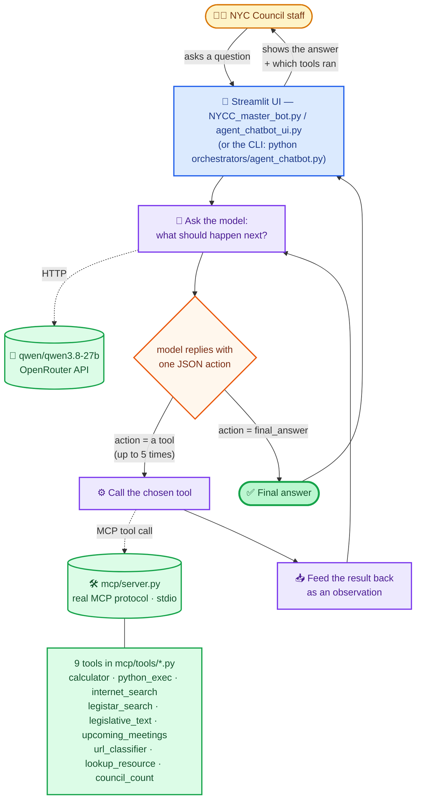

# NYCC AI Assistant

A local AI assistant for NYC Council staff. Ask it a question in plain English and it
figures out — on its own, tool by tool — what it actually needs to answer accurately:
legislation search, council meeting calendar, internal resource lookup, census
demographics, live web search, arithmetic, code execution, URL classification, text
embeddings, or internal legal-memo search. It answers using real data pulled from real
systems, not from what the model remembers.

**This is the OpenRouter clone.** The agent reaches its model through
[OpenRouter](https://openrouter.ai) by default, so it runs anywhere — the council VPN is
no longer needed for the model itself. Set `OPENROUTER_API_KEY` (see [Configure
secrets](#configure-secrets)) and it works.

**Every tool runs on a public source.** No council network, no VPN, no internal API. The
four tools that used to depend on council-only services were rebuilt on data the City and
the Council already publish — see [Tools rebuilt on public
sources](#tools-rebuilt-on-public-sources) for what moved where. The internal model routes
are still here for VPN use: `qwen` (the council's Open WebUI deployment, needs
`OWUI_API_KEY`) and `gemma` (not deployed anywhere reachable) — see [Switching back to the
internal model](#switching-back-to-the-internal-model).

**There is exactly one orchestrator: the multi-tool agent (`agent_chatbot.py`).** An
earlier "single-route" pipeline (classify a query into one route, call one tool) existed
and was removed — see [Known limitations](#known-limitations) and the
`legacy-single-route-pipeline` branch if it's ever needed for reference.

---

## Architecture



**Step by step, for one question:**

1. **Staff member asks a question** in a Streamlit UI or the CLI.
2. The agent (`agent_chatbot.py`) sends the conversation so far, plus a catalog of all
   available tools, to the model — `qwen/qwen3.8-27b` on OpenRouter by default —
   through `call_model` in `orchestrators/mcp_client.py`. That call goes **straight to
   OpenRouter**: it is already a hosted HTTP endpoint, so there is no local proxy in the
   way and nothing to start. Setting `API_URL` instead routes the same call through
   `local_ai.py`, which is how the internal Open WebUI deployment is reached on the VPN.
   Both speak the same OpenAI-shaped JSON, which is why swapping between them changes
   nothing above this line.
3. The model replies with **one JSON action**: either `{"action": "<tool name>",
   "action_input": {...}}` or `{"action": "final_answer", "action_input": {"answer":
   "..."}}`.
4. If it's a tool call, the agent sends it to `mcp/server.py` over the **real MCP
   protocol** (spawned as a stdio subprocess — this is genuinely using MCP, not
   simulating it) and gets back the tool's real result.
5. That result is appended to the conversation as an **observation**, and the loop goes
   back to step 2 — the model sees what it just learned and decides what to do next.
6. This repeats for **up to 5 tool calls** per question. That cap, plus the feedback loop
   itself, is what makes something like *"what's 15% of the population of council
   district 31?"* actually work: the model looks up the population with `council_count`,
   sees the real number come back, and only then calls `calculator` on it.
7. Once the model is confident it has enough to answer, it replies with `final_answer`
   and the loop ends. The UI shows the answer along with which tools actually ran.

`MCPToolClient` (the MCP session wrapper) and `call_model` (the plain HTTP call to
`local_ai.py`) — the two pieces every entry point needs — live in
`orchestrators/mcp_client.py`, shared by `agent_chatbot.py` and reused by every UI on top
of it.

An internal `hello` tool also exists on the MCP server purely as a connectivity check —
it's hidden from the agent (`_HIDDEN_TOOLS` in `agent_chatbot.py`), not meant to be
called directly.

## The 9 tools

| Tool | What it does | Source | Needs |
|---|---|---|---|
| `lookup_resource` | Keyword search over `url_resources.yaml` (ESS, Timekeeping, etc.) | local file | — |
| `legistar_search` | Lists NYC Council bills and local laws matching a keyword — file number, status, sponsor, committee | NYC Open Data `6ctv-n46c` | — |
| `legislative_text` | Returns the legal text and plain summary of the most relevant bills, for "what does the law say about X" | NYC Open Data `6ctv-n46c` | — |
| `upcoming_meetings` | Council meetings/hearings in the next N days — committee, date, time, location, link | Legistar public calendar | — |
| `council_count` | Census demographics per council district: population, poverty, employment, insurance, foreign-born, veterans, ~190 ACS measures | `councilcount` package (local data) | — |
| `internet_search` | Live web search via `ddgs` (DuckDuckGo, no API key) | web | — |
| `calculator` | Safe AST-based math evaluator (no `eval()`) | local | — |
| `python_exec` | Restricted sandboxed Python execution | local | — |
| `url_classifier` | Matches a URL against known resources by domain | local file | — |

### Tools rebuilt on public sources

The original relied on four council-only services. None of them are reachable outside the
council network, and two of them need a token this clone has no way to obtain, so each was
rebuilt on a public equivalent:

| Original | Why it could not be used | Replacement |
|---|---|---|
| `legistar_search` via the Legistar Web API | The `nyc` client requires a Granicus-issued token; every tokenless request returns **403** | NYC Open Data **"City Council Legislation: Bills and Local Laws"** (`6ctv-n46c`) — 11,600+ bills with sponsor, status, committee, legal text and summary, no token |
| `upcoming_meetings` via the Legistar events API | Same token | Legistar's **public InSite calendar** (`Calendar.aspx`). NYC Open Data's meetings set (`m48u-yjt8`) was checked first and rejected: it ends at 2024-12-19, so it holds no future meetings at all |
| `council_count` via `councilcount-llm` on `10.250.7.47:5000` | Internal Flask service, unreachable off-VPN | The **`councilcount` package the Council publishes on PyPI**, which ships ACS estimates as data files — lookups are local, so this tool needs no network at all |
| `document_rag` over Council legal memos on `10.250.7.47:8000` | The memos themselves are not public; there is nothing to proxy | **`legislative_text`** — same "read the documents and answer" shape, over the public legislative record instead. It is a different corpus, not the same one from elsewhere |

`embed_text` was **removed** rather than replaced. It called the internal `octen-8b` model,
and there is no public keyless embeddings endpoint to swap in — OpenRouter serves chat
completions only. The tool also returned a raw vector preview the agent could not use in an
answer. `mcp/tools/embeddings.py` is still on disk and still works on the VPN; re-register
it in `mcp/server.py` to bring it back.

## Example queries

A feel for what the agent chains together, and how many tool calls each one takes:

| Query | Tools called | Why |
|---|---|---|
| *"What's the population of Council District 31?"* | `council_count` | Single lookup, one step, straight from local ACS data. |
| *"What's 15% of the population of Council District 31?"* | `council_count` → `calculator` | Needs the real number back before it can do the math on it. |
| *"What bills has the Council introduced about lithium-ion battery safety?"* | `legistar_search` | Real legislation from Open Data, not the model's memory. |
| *"What does NYC Council legislation say about street vendor enforcement?"* | `legislative_text` | Wants the text of the law, not a list of file numbers — the distinction the two legislation tools are split along. |
| *"Are there any Council hearings in the next 7 days?"* | `upcoming_meetings` | Reads the Council's live public calendar. |
| *"Who is the current Speaker, and what is 7% of 1200?"* | `internet_search` → `calculator` | Two independent pieces of information in one question — this is exactly what the old single-route pipeline structurally couldn't do. |

Every row above was run against this build, not sketched from the design.

## Project structure

```text
NYCC_AI/
├── Dockerfile
├── docker-compose.yml
├── requirements.txt
├── local_ai.py                   # FastAPI proxy - OPTIONAL, only for the internal
│                                  # qwen/gemma routes on the council VPN
├── url_resources.yaml            # Internal NYC Council resource directory
├── .env.example                  # Template for .env - copy it, fill in real values
├── .env                          # OPENROUTER_API_KEY (+ optional LEGISTAR_API_TOKEN /
│                                  # OWUI_API_KEY) - gitignored, create this yourself
├── orchestrators/
│   ├── mcp_client.py             # Shared MCPToolClient + call_model (calls OpenRouter
│   │                             # directly, or a local_ai.py route if API_URL is set)
│   └── agent_chatbot.py          # The multi-tool agent loop - the only orchestrator
├── ui/                           # Streamlit front-ends, both wrap agent_chatbot.py
│   ├── agent_chatbot_ui.py       # "NYC Council Internal AI - Agent" - shows tool calls, for demos/dev
│   └── NYCC_master_bot.py        # "NYCC Master Bot" - polished, staff-facing, + feedback
├── feedback/                     # One JSON file per feedback submission from NYCC_master_bot.py
│                                  # (fully gitignored, not even the folder itself is tracked -
│                                  # created automatically on first feedback submission / by Docker)
├── prompts/
│   ├── agent_system_prompt.txt   # The agent's actual system prompt - loaded at runtime
│   └── NYCC_constitution.txt     # Source-of-truth reference the prompt's rules were derived
│                                  # from - not loaded by any code, kept for context
└── mcp/
    ├── server.py                 # MCP tool server (FastMCP, stdio transport)
    └── tools/                    # One file per tool, all registered in server.py
        ├── calculator.py
        ├── calendar_tool.py           # public Legistar calendar
        ├── councilcount_tool.py       # public councilcount package
        ├── legislative_text.py        # replaces document_rag.py
        ├── embeddings.py              # NOT registered - internal model only
        ├── legistar.py                # public NYC Open Data
        ├── python_tool.py
        ├── resources.py
        ├── url_classifier.py
        └── web_search.py
```

## Setup

### Prerequisites
- Python 3.12+ (a venv named `nyc_project/` is expected at the repo root) — or just
  Docker, see [Running with Docker](#running-with-docker) for the fastest path
- An OpenRouter API key (`OPENROUTER_API_KEY`) from https://openrouter.ai/keys —
  required, the default route won't respond without it
- Nothing else. No VPN, no council network, no Legistar token: every tool runs on a
  public source

### Install
```bash
cd NYCC_AI
python3 -m venv nyc_project
source nyc_project/bin/activate
pip install -r requirements.txt
```

One note on the pins: `councilcount` (which backs `council_count`) pins exact versions of
`requests`, `certifi`, `urllib3`, `numpy` and `pandas`. Rather than fight that, this
project deliberately does **not** pin those five itself, so pip resolves them from
councilcount and a plain install just works — including on hosts that only run
`pip install -r requirements.txt` and cannot take extra flags.

### Configure secrets
Copy the template and fill in real values (`.env` is gitignored — never commit it):
```bash
cp .env.example .env
```
```
OPENROUTER_API_KEY=sk-or-v1-...          # required - the default route needs it
OPENROUTER_MODEL=qwen/qwen3.8-27b    # optional - any OpenRouter model id
LEGISTAR_API_TOKEN=your-token-here       # optional
OWUI_API_KEY=your-key-here               # only for the on-VPN "qwen" route
```
`OPENROUTER_API_KEY` authenticates every call on the default route — without it, chat
requests fail immediately with a clear 500 instead of silently doing nothing. A `.env`
at the project root (one level above `NYCC_AI/`) is picked up too, so the key can live
in one place for the whole project.

`OPENROUTER_MODEL` chooses which model the agent thinks with. It defaults to
`qwen/qwen3.8-27b` — the same model the council serves internally, so the system prompt
is running against exactly what it was written for — but any of OpenRouter's several hundred ids works
(`anthropic/claude-sonnet-4.5`, `openai/gpt-4o`, `google/gemini-2.5-flash`, …). A single
request can also pick a different model for one run:

```bash
OPENROUTER_MODEL=anthropic/claude-sonnet-4.5 python orchestrators/agent_chatbot.py
```

(When running through the proxy, the same override travels in the request body as
`"model": "anthropic/claude-sonnet-4.5"`.)

Models differ in how reliably they emit the strict `{"action", "action_input"}` JSON the
agent loop depends on. The loop already retries a malformed reply twice before giving up,
so a weaker model degrades into extra retries rather than visible errors — but if you see
frequent fallback messages, try a stronger model first.

`SOCRATA_APP_TOKEN` is optional. `legistar_search` and `legislative_text` read NYC Open
Data anonymously, which works but shares a rate limit with every other anonymous caller;
a free app token (https://data.cityofnewyork.us/profile/edit/developer_settings) raises
it. Nothing breaks without one.

`council_count` needs no configuration at all — its data ships inside the `councilcount`
package, so it does not make a network request.

## Running it

One terminal, one command. The agent calls OpenRouter directly, so there is no model
server to start first:

```bash
cd NYCC_AI
source nyc_project/bin/activate
```

Then pick an entry point:

| What | Command |
|---|---|
| **NYCC Master Bot** — polished, staff-facing, feedback popup (recommended for real users) | `streamlit run "ui/NYCC_master_bot.py"` |
| Agent UI — shows every tool call live (for demos/dev) | `streamlit run ui/agent_chatbot_ui.py` |
| Agent CLI (for debugging without a browser) | `python orchestrators/agent_chatbot.py` |

If a UI reports it *could not reach the model*, check your internet connection and that
`OPENROUTER_API_KEY` is set — a bad key reports itself as a `401` with OpenRouter's own
message rather than a generic failure.

`local_ai.py` is still here but is **not** needed on this path. It is the proxy the
internal Open WebUI deployment requires, and it only runs when you ask for it — see
[Switching back to the internal model](#switching-back-to-the-internal-model).

## Running with Docker

This is the easiest way to run everything — no local Python/venv setup needed at all,
just Docker. This is the recommended path for anyone who just wants to run the agent,
not develop it.

```bash
cd NYCC_AI
cp .env.example .env    # fill in OPENROUTER_API_KEY (required), LEGISTAR_API_TOKEN (optional)
docker compose up -d master-bot
```

Then open **`http://localhost:8503`**. That's the whole setup — two commands.

Every service reads `.env` automatically (`env_file` in `docker-compose.yml`) — no
secrets are ever baked into the image, and you don't need to pass them individually per
service. All three UI/CLI services point at the `openrouter` route by default. It's fine to `docker compose up`/`build` even before `.env` exists; the
containers just start with no keys configured until you add it and restart.

Services:

| Service | What it runs | Access |
|---|---|---|
| `server` | `local_ai.py` (FastAPI proxy) | `http://localhost:8001` |
| `agent-cli` | agent CLI | `docker compose run --rm agent-cli` |
| `agent-ui` | agent Streamlit UI | `http://localhost:8502` |
| `master-bot` | **NYCC Master Bot** (staff-facing + feedback) | `http://localhost:8503` |

`server` is **optional** and no longer a dependency of anything: the UIs and CLI reach
OpenRouter on their own. Start it only if you want the proxy — on the council VPN, for
the internal `qwen` route — and then point a service at it with
`API_URL=http://server:8000/chat/qwen`. It keeps its real healthcheck (not just
"container started") for that case.

Start every UI at once:
```bash
docker compose up -d agent-ui master-bot
```

`master-bot`'s `feedback/` directory is mounted as a volume (`./feedback:/app/feedback`)
so submitted feedback survives container restarts and rebuilds — it is **not** just
written to the container's disposable filesystem. Docker creates that folder on the host
automatically on first run if it doesn't already exist.

Useful commands:
```bash
docker compose logs -f master-bot     # tail logs for one service
docker compose ps                     # what's running
docker compose down                   # stop everything
docker compose up -d --build server master-bot   # rebuild after pulling code changes
```

## Adding a new tool

Every tool is a plain Python function, registered once. There's exactly one place to add:

1. Write the function in a new (or existing) file under `mcp/tools/`, returning a plain
   string.
2. Register it in `mcp/server.py`:
   ```python
   from tools.my_new_tool import do_the_thing

   @mcp.tool()
   def my_new_tool(query: str) -> str:
       """One clear sentence describing what this does and when to use it -
       this is literally what the model sees when deciding whether to call it."""
       return do_the_thing(query)
   ```
3. That's it — `agent_chatbot.py` builds its tool catalog live from whatever
   `mcp/server.py` has registered (`_format_tool_catalog`), so there's no second place to
   register anything, and no restart-the-agent-separately step. The docstring is doing
   real work here: a vague description means the model either never picks the tool or
   picks it for the wrong queries, so write it the way you'd explain the tool to a
   coworker in one sentence.

## Known limitations

- **Council legal memos are simply gone from this clone** — `legislative_text` searches
  public bills and local laws, which is a *different corpus* from the internal RAG's legal
  memos, not a public copy of it. A question that genuinely needs a memo cannot be
  answered here, and the tool says so rather than passing off a bill as one.
- **`upcoming_meetings` parses HTML, not an API** — Legistar publishes no tokenless
  calendar API, so the tool reads the public calendar page's table markup. A Legistar
  redesign would break it; it returns "could not read the meeting table" in that case
  rather than wrong dates. NYC Open Data's meetings dataset is not a fallback: it ends at
  2024-12-19 and contains no future meetings.
- **`council_count` reports ACS survey estimates, not counts** — figures carry a margin of
  error (the tool includes it; the system prompt tells the model to pass it along), come
  from the 2019-2023 5-year survey, and use the Council's modelled apportionment to
  district boundaries. The internal tool's building-level (BBL) lookups and non-district
  geographies are not wired up here.
- **NYC Open Data legislation lags Legistar slightly** — the dataset is refreshed on the
  City's schedule, so a bill introduced in the last day or two may not appear yet.
- **The system prompt was tuned against `qwen3.8-27b`**, which is the default here, so
  the pairing matches the original. Other OpenRouter models follow the JSON-action
  contract with varying reliability; the loop's two format retries absorb most of that,
  at the cost of extra model calls.
- **`gemma` is not currently deployed anywhere reachable** — `local_ai.py` still has a
  route for it pointing at its old address, but the council moved model hosting to Open
  WebUI (`qwen` only) and never redeployed `gemma` there. Requests to `gemma` fail with a
  clear connection error, not silently.
- **The agent has no memory across turns** — each question in `agent_chatbot.py`/
  `agent_chatbot_ui.py` is answered in isolation; follow-ups like "what's 15% of *that*"
  won't resolve to a prior answer.
- **`council_count`'s variable matching is keyword-based, not semantic** — reliable for
  common terms (population, poverty, unemployment, insurance, veterans, foreign-born) but
  approximate for obscure ACS variables, and it handles one measure per call. It always
  names the variable it matched, so a wrong guess is visible in the answer rather than
  silent.
- **The agent loop's 5-tool-call cap is a hard limit** with no cost/token budget
  tracking — a complex multi-hop question could still cost up to 6 sequential model
  calls before answering.
- **A single-route pipeline used to exist alongside the agent** (`ai_router.py`,
  `final_model_output.py`, `final_master_chatbot.py`, `chatbot_ui.py`,
  `chat_client.py`) and has been fully removed as of this version — it's preserved on
  the `legacy-single-route-pipeline` branch, not deleted from history.

## API reference (`local_ai.py` — the optional proxy)

You only need this section if you are running `local_ai.py`, which the OpenRouter path
does not.

```text
GET  /                    -> {"status": ..., "routes": [...], "openrouter_model": ...}
POST /chat/{route}        -> proxies to a model (route = "openrouter", "qwen" or "gemma")
```

The POST body is `{"messages": [...], "temperature": 0.7, "max_tokens": 512}`, plus an
optional `"model"` to override the route's configured model id for that one request.

```bash
curl http://localhost:8000
# {"status":"NYCC local AI router is running","routes":["openrouter","qwen","gemma"],
#  "openrouter_model":"qwen/qwen3.8-27b"}
```

### Switching back to the internal model

Nothing was removed — the internal routes still exist, and `local_ai.py` is the proxy
that fronts them. On the council VPN, start it and point an entry point at it:

```bash
uvicorn local_ai:app --reload                                        # terminal 1
API_URL=http://localhost:8000/chat/qwen python orchestrators/agent_chatbot.py   # terminal 2
```

Setting `API_URL` is the whole switch: unset it and `call_model` goes straight to
OpenRouter; set it and every call routes through `local_ai.py` instead. (Running
`python local_ai.py` directly does nothing — the file only defines the FastAPI app and
has no `__main__` entry point, so it must be launched via `uvicorn`.)

For Docker, add `API_URL=http://server:8000/chat/qwen` to the service's `environment`
and start `server` alongside it. `qwen` needs `OWUI_API_KEY` in `.env`; `gemma` remains
undeployed and fails with a clear connection error.
